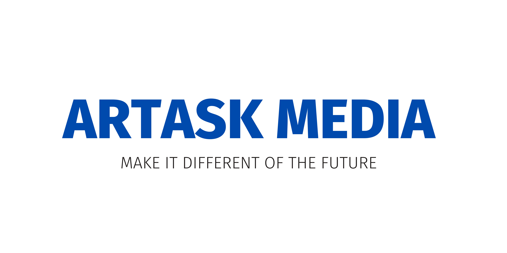

<h2>Hey! 👋</h2>

 

I'm Hanif Bagus Saputra!
- <i>Currently:</i> MS CS Student at University of STMIK at Indonesia

<h2>💻 I'm Currently workng on</h2>

- Fullstack Website Development
- Arduino IOT Programming

<!--
__Check out my GitHub repository:__

  

    
    
  

-->
<h2>👀 Stats</h2>

  

  <b><em>GitHub Stats:</em></b>  
       
  <b><em>Programming activity (Last 7 days):</em></b>  
    
  

<h2>📫 How to reach me:</h2>
<a href="https://www.instagram.com/octazoneid/">![Instagram]
(https://img.shields.io/badge/Instagram-bc2a8d?style=for-the-badge&logo=Instagram&logoColor=white)</a>
<!--
**artask-media/artask-media** is a ✨ _special_ ✨ repository because its `README.md` (this file) appears on your GitHub profile.

Here are some ideas to get you started:

- 🔭 I’m currently working on ...
- 🌱 I’m currently learning ...
- 👯 I’m looking to collaborate on ...
- 🤔 I’m looking for help with ...
- 💬 Ask me about ...
- 📫 How to reach me: ...
- 😄 Pronouns: ...
- ⚡ Fun fact: ...
-->
